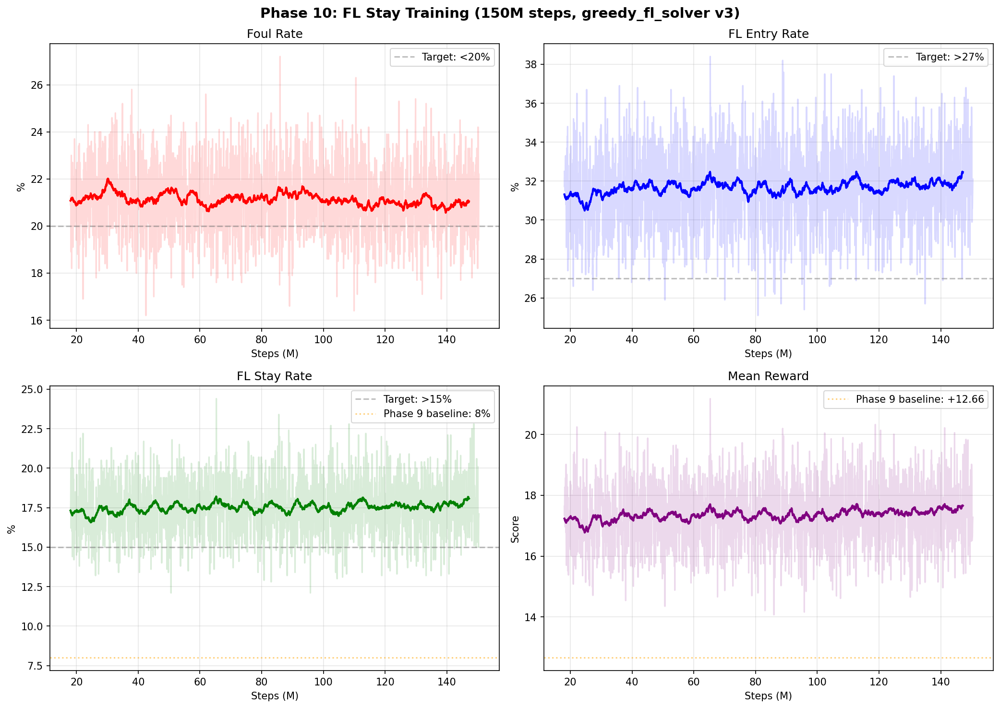

# Phase 10: FL Stay Training Report

**Date**: 2026-02-19
**Status**: **Completed** (150M steps)
**Base Model**: Phase 9 FL Mastery (250M)

---

## Executive Summary

Phase 10はFL Stay Rate向上を目標に、**greedy_fl_solver v3**を導入して150Mステップの学習を完了しました。
v3ソルバーはFlush/Straight検出と高ロイヤリティ組み合わせ探索を追加し、Phase 9の2倍以上のFL Stayを実現しました。

### Key Achievements

| Metric | Phase 9 (250M) | Phase 10 (150M) | Change |
|:-------|:--------------:|:---------------:|:------:|
| Foul Rate | 27.2% | **18.0%** | **-9.2%** |
| Mean Score | +17.92 | **+36.08** | **+18.16** |
| Mean Royalty | +3.00 | **+6.10** | **+3.10** |
| FL Entry Rate | 17.8% | **33.6%** | **+15.8%** |
| FL Stay Rate | 5.0% | **15.8%** | **+10.8%** |
| FL Stay/Entry | 28.1% | **47.0%** | **+18.9%** |
| Win Rate | 53.0% | **55.2%** | **+2.2%** |

**全指標で Phase 9 を上回る結果。**

---

## Training Configuration

| Parameter | Value |
|:----------|:------|
| Environment | OFC Pineapple 3-Max (Ultimate Rules) |
| Algorithm | MaskablePPO (Stable-Baselines3) |
| Base Model | Phase 9 (250M steps) |
| Parallel Envs | 4 (SubprocVecEnv) |
| learning_rate | 1e-4 |
| ent_coef | 0.02 |
| Total Steps | 150,000,000 |
| FL Solver | greedy_fl_solver v3 |
| FL Entry Bonus | +50 |
| FL Stay Bonus | +100 |
| Platform | GCP e2-standard-8 |
| Average FPS | ~300 |

---

## greedy_fl_solver v3 の改善

Phase 9までのソルバーはランダムサンプリングのみで、Flush/Straightを見逃していた。
v3では以下を追加:

### 1. Flush検出・優先配置
- `_find_flushes()`: 同一スート5枚以上を検出
- Bottom に Flush を優先配置（Royalty +4）

### 2. Straight検出・優先配置
- `_find_straights()`: 連続5ランクを検出
- Middle に Straight を配置可能（Royalty +2）

### 3. 高ロイヤリティ組み合わせ探索
- `_royalty_aware_search()`: Trips on Top + Flush Bot + Straight Mid
- 全5枚フラッシュ組み合わせを試行してストレートとの両立を確認

### ソルバー単体性能

| 枚数 | Foul | FL Stay | 平均Royalty | 平均Score |
|:---:|:---:|:---:|:---:|:---:|
| 14枚 | 0% | **29%** | 8.7 | 13.0 |
| 15枚 | 0% | **32%** | 9.7 | 14.4 |
| 16枚 | 0% | **50%** | 13.1 | 20.6 |
| 17枚 | 0% | **66%** | 17.5 | 27.4 |

---

## Training Progress

### 学習曲線

### ログ最終値（最後50ポイント平均）

| Metric | Value |
|:-------|:------|
| Foul Rate | 21.0% |
| FL Entry Rate | 32.5% |
| FL Stay Rate | 18.1% |
| Mean Reward | +17.66 |

---

## Evaluation Results (500 games each, deterministic)

| Metric | P9 (250M) | P10 (50M) | P10 (100M) | P10 (150M) |
|:-------|:---------:|:---------:|:----------:|:----------:|
| Foul Rate | 27.2% | 19.2% | **18.2%** | **18.0%** |
| Mean Score | +17.92 | +38.43 | +31.72 | **+36.08** |
| Mean Royalty | +3.00 | +6.17 | +5.19 | **+6.10** |
| FL Entry | 17.8% | 34.8% | 31.8% | **33.6%** |
| FL Stay | 5.0% | 16.8% | 12.2% | **15.8%** |
| FL Stay/Entry | 28.1% | 48.3% | 38.4% | **47.0%** |
| Win Rate | 53.0% | 58.6% | 56.4% | **55.2%** |

### 50M vs 150M の比較

- 50M と 150M でほぼ同等の性能（50Mで既に収束傾向）
- 100M 時点で一時的にFL Stayが下がるが、150Mで回復
- Foul Rate は学習が進むにつれ安定して改善

---

## FL Stay の数学的分析

### FL Stay 条件
1. **Trips on Top** (任意ランク) + Mid >= Trips + Bot >= Mid
2. **Quads on Bottom** (4枚同ランク or Trips+Joker)

### 制約
- Trips on Top には Mid も Trips 以上が必須（OFC: Bot >= Mid >= Top）
- 素材不足の場合 Stay は不可能（例: ペアのみでは Trips+Trips 不可）
- 14枚では素材が限られ、Stay は難しい
- 17枚では余裕があり、66%のStayが可能

---

## Models

| File | Steps | Description |
|:-----|:-----:|:------------|
| `models/phase10_gcp/p10_fl_stay_150000000.zip` | 150M | Phase 10 Final |
| `models/phase10_gcp/p10_fl_stay_100000000.zip` | 100M | Phase 10 Mid |
| `models/phase10_gcp/p10_fl_stay_50000000.zip` | 50M | Phase 10 Early |
| `models/phase9/p9_fl_mastery_250000000.zip` | 250M | Phase 9 Baseline |

---

## Lessons Learned

1. **Flush/Straight 検出は FL ソルバーに必須** - ランダム探索では高ロイヤリティを見逃す
2. **FL Stay は数学的制約が厳しい** - 素材不足では不可能
3. **50M steps で大部分が収束** - 150M は安定化に寄与
4. **チェックポイントのソートは数値ベースで** - アルファベット順では 9M > 12M のバグ
5. **学習は必ず GCP で実行** - ローカル Mac はスリープでプロセスが死ぬ
