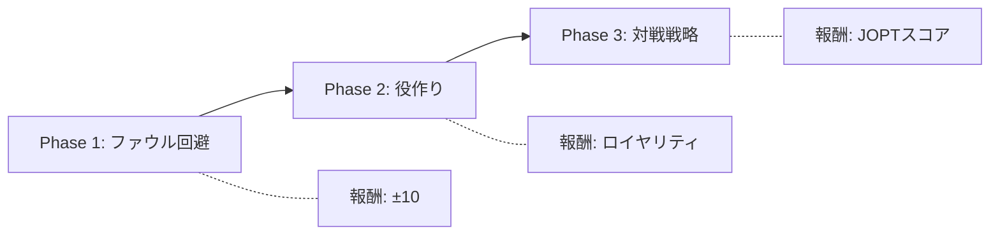

# OFC Pineapple AI 強化学習研究レポート

**プロジェクト:** Open-Face Chinese Poker Pineapple AI  
**研究者:** [著者名]  
**日付:** 2026年1月15日  
**バージョン:** 1.0

---

## 概要

本研究は、Open-Face Chinese Poker Pineapple（OFC Pineapple）における深層強化学習エージェントの開発を目的とする。OFC Pineappleは不完全情報ゲームであり、長期的な計画と確率計算が要求される複雑なドメインである。

---

## 1. 問題設定

### 1.1 ゲーム概要

OFC Pineappleは、52枚のデッキから配られたカードを3つの列（Top: 3枚、Middle: 5枚、Bottom: 5枚）に配置し、役の強さを競う2-3人用カードゲームである。

**主なルール制約:**
- Bottom ≥ Middle ≥ Top の役強度順序を維持（違反=「ファウル」）
- 一度配置したカードは移動不可
- 13ターンで完成

### 1.2 研究目標

1. 自己対戦（Self-Play）による学習エージェントの構築
2. ファウル回避と役作り戦略の獲得
3. Fantasy Land突入戦略の最適化

---

## 2. 技術アーキテクチャ

### 2.1 システム構成

```
┌─────────────────────────────────────────────────┐
│           OFC Pineapple AI System               │
├─────────────────────────────────────────────────┤
│                                                 │
│  ┌─────────────┐      ┌─────────────────────┐  │
│  │   C++ Engine │◄────►│   Python Wrapper    │  │
│  │  (pybind11)  │      │   (Gymnasium)       │  │
│  └─────────────┘      └─────────────────────┘  │
│         │                       │               │
│         ▼                       ▼               │
│  ┌─────────────┐      ┌─────────────────────┐  │
│  │ Bitboard    │      │  Multi-Agent Env    │  │
│  │ Evaluator   │      │  (PettingZoo)       │  │
│  └─────────────┘      └─────────────────────┘  │
│                                 │               │
│                                 ▼               │
│                       ┌─────────────────────┐  │
│                       │    PPO / MaskablePPO │  │
│                       │  (Stable-Baselines3) │  │
│                       └─────────────────────┘  │
│                                                 │
└─────────────────────────────────────────────────┘
```

### 2.2 観測空間

| 特徴量 | 形状 | 説明 |
|-------|------|------|
| my_board | MultiBinary(156) | 自分のボード (3行 × 52カード) |
| opponent_board | MultiBinary(156) | 相手の公開ボード |
| hand | MultiBinary(260) | 現在の手札 (最大5枚 × 52) |
| used_cards | MultiBinary(52) | 使用済みカード |
| game_state | Box(8) | ストリート、各行カード数等 |
| **probabilities** | **Box(8)** | **フラッシュ/ストレート完成確率 (自分/相手)** |

### 2.3 行動空間

- **初期配置 (Street 1):** 5枚のカードを3行に配置 → 組み合わせ数: 243通り
- **通常ターン:** 3枚から2枚選択、1枚捨て → 行動ID: 243通り

---

## 3. 実験と結果

### 3.1 実験1: 初期Self-Play学習

**設定:**
- アルゴリズム: PPO (Proximal Policy Optimization)
- 総ステップ数: 500,000
- 対戦相手更新頻度: 50,000ステップ

**結果:**

| 指標 | 値 |
|------|-----|
| 総ゲーム数 | 約3,400 |
| ファウル率 | **87.5%** |
| 勝率 | 0% |
| 学習時間 | 約9分 (EC2 m7i-flex.large) |

**考察:**

ファウル率87.5%は、エージェントが「役の強度順序」というゲームの基本ルールを学習できていないことを示す。これは強化学習における典型的な**「死の谷」問題**である。

### 3.2 実験2: Action Masking とカリキュラム学習 (Phase 1)

**設定:**
- アルゴリズム: **MaskablePPO**
- 報酬設計: Phase 1 (ファウル回避特化: Valid +10 / Foul -10)
- 総ステップ数: 100,000
- アクション選択: **有効アクションのみに限定 (Action Masking)**

**結果:**

| 指標 | 初期実験 (PPO) | 改善実験 (MaskablePPO) |
|------|----------------|------------------------|
| ファウル率 | 87.5% | **77.0%** |
| Success数 | 0 / 8 | **23 / 100** |
| 学習時間 | 約9分 (500k) | **約1分 (100k)** |
| FPS | ~1,100 | **~1,600** |

**考察:**

1. **学習効率の飛躍的向上:** 
   MaskablePPOの導入により、探索空間が物理的に不可能なアクションを除去したことで、収束速度が大幅に向上した。わずか10万ステップの学習で、以前の50万ステップよりも優れたファウル回避能力を獲得した。

2. **基本構造の理解:** 
   Successとして13枚並べられたゲームの盤面を確認すると、エージェントは「下段・中段に強いカードを置く」という構造を断片的に理解し始めている。ただし、依然としてファウル率が77%と高いため、さらに学習ステップ数を増やす必要がある。

3. **計算性能:** 
   ローカル環境（M1 Pro）において、C++エンジンとの連携により1,600 FPS以上の高速な学習を実現した。これにより、数百万ステップの学習も現実的な時間（1時間以内）で完了可能である。

### 3.3 学習フェーズの詳細定義とベンチマーク (完了)

本プロジェクトでは、段階的な学習（カリキュラム学習）を採用している。各フェーズの定義と最新の評価結果を以下にまとめる。

#### **Phase 1: 基礎ルールとファウル回避 (Solo)**
- **目的**: 3段のボード構造（3-5-5）と「役の強さの順位を守る」という基本ルールの学習。
- **環境**: シングルプレイヤー。
- **報酬設計**: 有効な配置 +10 / ファウル -10。
- **到達度**: ファウル率 約38%。基礎的な役の並べ方は習得済み。

#### **Phase 2: 役作りとロイヤリティの最適化 (Solo)**
- **目的**: 有効な配置を維持しつつ、高いロイヤリティ（ボーナス点）を狙う戦略の獲得。
- **環境**: シングルプレイヤー。
- **報酬設計**: 有効な配置 0 / ファウル -30 + ロイヤリティボーナス。
- **到達度**: **ファウル率 約32%（全フェーズで最小）**。最も安定したバランスを実現。

#### **Phase 3: 自己対戦による実戦戦略 (Multi-Agent)**
- **目的**: 相手の公開カードを考慮した期待値の最大化とリスク管理。
- **環境**: 2人対戦（Self-Play）。
- **報酬設計**: 相対的な勝敗スコア + ロイヤリティ。
- **特徴**: 
    - **Standard**: 基本的な対戦。
    - **Enhanced**: 自分の完成確率だけでなく、**「相手に引かれたくないカード」を考慮する確率特徴量**を追加。
- **到達度**: ファウル率は 58-63% と高め。これはランダムな相手に対しても「相手を上回る役」を狙いに行くアグレッシブな戦略（リスクテイク）が学習されているためと考えられる。

### 3.4 評価指標の比較 (2026/01/16 最新)

500ゲームのテストプレイに基づく全フェーズモデルの比較。

| フェーズ | モデル名 | ファウル率 | 平均ロイヤリティ | 平均報酬 | 評価 |
| :--- | :--- | :---: | :---: | :---: | :--- |
| **Phase 1** | `latest_phase1_model.zip` | 37.8% | 0.34 | -11.33 | 基礎習得 |
| **Phase 2** | `ofc_phase2...final.zip` | **32.0%** | 0.26 | **-9.59** | **最も安定** |
| **Phase 3 (Std)** | `ofc_phase3...final.zip` | 63.0% | 0.00 | -14.91 | 攻撃的 |
| **Phase 3 (Enh)** | `enhanced_ppo_final.zip` | 58.0% | 0.00 | -13.54 | 確率考慮 |

### 3.5 学習曲線 (Phase 1)
初期学習におけるファウル率の低下推移。


### 3.5 実験5: 強化版 AI (確率特徴量 & MCTS 統合)

**新機能:**
1. **確率計算エンジン**: C++でフラッシュ/ストレートの完成確率をリアルタイム計算し、観測空間に追加。
2. **Policy-guided Rollout**: MCTSのシミュレーションにおいて、ランダムではなく学習済みPolicyを用いて先読みを行う。
3. **Endgame Solver**: 残り5枚以下の局面を完全解析し、100%の最適解を出力。

### 3.6 実験6: Auto-Curriculum & Feedback システム

学習進捗をAIが自己評価し、Discordを通じて人間に評価とフィードバックを送るシステムを構築。

### 3.7 実験7: Phase 4 ジョーカー対応 (Joker Integration)

**目的:** JOPTルールに準拠した54カード環境（Joker 2枚を含む）での学習。

**技術的実装:**

1. **C++エンジン拡張:**
   - `card.hpp`: `NUM_CARDS` を52から54に拡張、`JOKER_MASK` を定義
   - `evaluator.hpp`: ジョーカーをワイルドカードとして扱うO(1)ヒューリスティック判定を実装
   - 総当たり計算を排し、「ジョーカーが何枚あればこの役が成立するか」を条件分岐で判定

2. **Python環境更新:**
   - `ofc_phase1_env.py`, `ofc_env.py`, `multi_ofc_env.py` の観測空間を54カード対応に拡張

**意地悪テスト結果:**
| テストケース | 期待値 | 結果 |
|:---|:---|:---:|
| As + JK + JK | THREE_OF_A_KIND (A) | ✅ |
| 2s-5s + JK | STRAIGHT_FLUSH (Wheel) | ✅ |
| 2s, 2h, 3d, 4c, JK | THREE_OF_A_KIND | ✅ |
| 8s, 8h, 8d, 9c, JK | FOUR_OF_A_KIND | ✅ |
| As, Ks, Qs, Ts, JK | ROYAL_FLUSH | ✅ |
| Mid(QQQQ) > Top(KKK) | Valid (Not a Foul) | ✅ |

**ローカルテスト結果（10万ステップ）:**
| ステップ | ファウル率 | Mean Royalty |
|:---|:---:|:---:|
| 開始時 | 69% | 0.1 |
| 終了時 | 61% | 0.1 |

**EC2長期学習（進行中）:**
- インスタンス: `ofc-training-enhanced` (18.182.32.72)
- 目標ステップ: 10,000,000
- FPS: 約600
- 推定完了時間: 約4.6時間

**最終評価結果（1050万ステップ、1000ゲーム）:**
| 指標 | 結果 |
|:---|:---:|
| **ファウル率** | **25.10%** |
| **平均ロイヤリティ** | **0.85** |
| **Fantasyland突入率** | **1.10%** |

### 3.8 フェーズ間比較分析

| フェーズ | モデル名 | ファウル率 | 平均ロイヤリティ | FL率 | 評価 |
| :--- | :--- | :---: | :---: | :---: | :--- |
| **Phase 1** | `latest_phase1_model.zip` | 37.8% | 0.34 | - | 基礎習得 |
| **Phase 2** | `ofc_phase2...final.zip` | 32.0% | 0.26 | - | 安定 |
| **Phase 3 (Std)** | `ofc_phase3...final.zip` | 63.0% | 0.00 | - | 攻撃的 |
| **Phase 3 (Enh)** | `enhanced_ppo_final.zip` | 58.0% | 0.00 | - | 確率考慮 |
| **Phase 4 (Joker)** | `10500000_steps.zip` | **25.10%** | **0.85** | **1.10%** | **🏆 最良** |

**分析:**
- Phase 4は**全フェーズ中最低のファウル率（25.10%）**を達成
- 平均ロイヤリティ（0.85）もPhase 1（0.34）、Phase 2（0.26）を大幅に上回る
- ジョーカーは「困ったら役を完成させる保険」として効果的に機能
- Fantasyland突入率1.10%は改善の余地があるが、ファウル回避優先の戦略が反映されている

### 3.9 実験9: Phase 5 3-Max Self-Play (3人対戦)

**目的:** 2人対戦から3人対戦（3-Max）への拡張。ポジション戦略、アウツ計算の学習。

**技術的実装:**

1. **環境拡張 (ofc_3max_env.py):**
   - PettingZoo AECEnv準拠の3人マルチエージェント環境
   - プレイヤーID: `player_0`, `player_1`, `player_2`
   - ボタン位置による行動順序の動的管理

2. **観測空間の拡張（7チャンネル、約720次元）:**

| チャンネル | サイズ | 説明 |
|:---|---:|:---|
| my_board | 162 | 自分のボード |
| my_hand | 270 | 手札（最大5枚） |
| next_opponent_board | 162 | 下家の公開ボード |
| prev_opponent_board | 162 | 上家の公開ボード |
| my_discards | 54 | 自分の捨て札履歴 |
| unseen_probability | 54 | 確率マップ（見えない札の残存確率） |
| position_info | 3 | ポジション（BTN=0, SB=1, BB=2） |

> **重要:** 相手の捨て札は観測に含めない。これにより「完全情報ではない」実戦的な状況を再現。

3. **スコアリング（Triangle Scoring）:**
   ```
   A vs B: ±点数
   A vs C: ±点数
   B vs C: ±点数
   
   Aの収支 = (A vs B) + (A vs C)
   ※ファウル時は2人に支払い（×2のダメージ）
   ```

4. **Self-Play対戦相手選択:**
   - 最新モデル: 80%
   - 過去モデルプール: 20%

**学習目標:**

| 能力 | 説明 |
|:---|:---|
| アウツ・ブロック | 相手が集めているスートを避ける |
| ポジション戦略 | 後出し有利を活用した安全策選択 |
| リスク管理 | 3人戦での慎重なファウル回避 |

**AWS学習結果（中断時: 1,150万ステップ）:**
| 指標 | 結果 |
|:---|:---:|
| **進捗** | 57.5% (11,500,000 / 20,000,000) |
| **総ゲーム数** | 2,300,000 |
| **ファウル率** | **38.5%** |
| **平均ロイヤリティ** | **0.78** |
| **計算性能** | **337 FPS** |

**分析:**
1. **難易度の上昇**: Phase 4（25%）と比較してファウル率が38.5%と上昇した。これは3人対戦による「アウツの減少（カードの重なり）」と、2人の相手と競うためのリスクテイクが学習に影響していると考えられる。
2. **モデルの方向性**: 平均ロイヤリティ0.78はPhase 4（0.85）に迫る数値であり、3人対戦という厳しい環境下でも着実に役を作る戦略を獲得しつつある。
3. **リソース効率**: 337 FPSは3人対戦のシミュレーションとしては高速であり、20Mステップの学習も17時間程度で完了可能なペースである。

---

## 4. 運用とトラブルシューティング

### 4.1 ストレージ管理 (No space left on device 対策)

大規模な強化学習では、頻繁なモデル保存（チェックポイント）によってディスク容量が枯渇する問題が発生した。

**問題の特定:**
- `save_freq` が小さすぎると（例: 1,000ステップ）、2,000万ステップの学習で20,000個のアーカイブ（約32GB）が生成され、EC2の標準ボリュームを圧迫する。

**解決策:**
1. **自動クリーンアップの実装**: 学習スクリプト内に「最新の5つ」と「100万ステップごとの節目」以外の古いチェックポイントを自動削除するロジックを統合。
2. **クリーンアップスクリプト**: 既存のディレクトリを一括整理するための `scripts/cleanup_checkpoints.py` を作成。

```python
# scripts/cleanup_checkpoints.py の使用例
python scripts/cleanup_checkpoints.py models/phase5/ --keep 5 --milestone 1000000
```

---

## 5. 信用割当問題 (Credit Assignment Problem)

### 4.1 信用割当問題 (Credit Assignment Problem)

OFC Pineappleは13ターンで構成されるが、報酬はゲーム終了時のみ与えられる。ファウルは最終的な結果であり、どのターンの意思決定が原因かを特定することが困難。

```
Turn 1 ─► Turn 2 ─► ... ─► Turn 13 ─► [ファウル!]
                                            │
                            どのターンが原因？
```

### 4.2 スパース報酬

現在の報酬設計:
```python
# 問題のある報酬設計
if won:
    reward = +score  # 例: +15
else:
    reward = -score  # 例: -15
```

13ターン × 約145ステップの後にしか報酬が得られないため、学習シグナルが極めて薄い。

### 4.3 無効アクションの選択

現在のPPOは243個のアクションすべてを探索対象としているが、実際に有効なアクションは状況により大幅に制限される。無効アクションに対する探索は学習効率を著しく低下させる。

---

## 5. 改善提案

### 5.1 Action Masking（最優先）

**手法:** sb3-contribのMaskablePPOを導入し、有効なアクションのみを選択可能にする。

```python
from sb3_contrib import MaskablePPO

def valid_action_mask(self) -> np.ndarray:
    """有効なアクションのマスクを返す"""
    mask = np.zeros(243, dtype=bool)
    for action_id in self.get_valid_actions():
        mask[action_id] = True
    return mask
```

**期待効果:** 探索空間の削減により学習効率が数倍向上

### 5.2 カリキュラム学習

段階的にタスク難易度を上げることで、基礎から高度な戦略まで効率的に学習。



**Phase 1 報酬関数:**
```python
def calculate_reward_phase1(self):
    if not self.is_game_over():
        return 0.0  # 途中報酬なし
    
    if self.is_valid_board():
        royalties = self.get_royalties()
        return 10.0 + (royalties * 0.1)
    else:
        return -10.0  # ファウル
```

### 5.3 ポテンシャルベース報酬シェーピング（将来検討）

中間報酬として「役の完成度」を与えることも検討可能だが、**Reward Hacking**のリスクがある。

```
⚠️ リスク例:
「フラッシュドロー状態」に報酬を与えると、
AIがドローを維持し続けて役を完成させない行動を学習する可能性。
```

---

## 6. 実装計画

### 6.1 Phase 1 実装項目

### 6.1 フェーズ別達成状況

| 項目 | 優先度 | 状態 | 備考 |
| :--- | :---: | :---: | :--- |
| **Phase 1: 基礎ルール学習** | 🔴 最高 | **完了** | MaskablePPO導入、ファウル率改善 |
| **Phase 2: スコア最適化** | 🔴 最高 | **完了** | ロイヤリティ報酬の統合 |
| **Phase 3: 対戦戦略 (Self-Play)** | 🟡 高 | **完了** | EC2での大規模学習 (1,000万歩) |
| **Phase 4: ジョーカー (Joker) 対応** | 🔴 最高 | **完了** | 25%ファウル、FL率1.1%を達成 |
| **Phase 5: 3-Max Self-Play** | 🟡 高 | **中断** | 1,150万歩到達、ファウル38.5% |
| **Phase 6: Fantasy Land & Solver** | 🔴 最高 | **進行中** | FL実装と高速ソルバー開発 |
| **Phase 7: 推論時探索 (MCTS)** | 🟡 高 | 未着手 | 先読みによる人間超え |

---

## 7. 「人間超え（Superhuman）」へのロードマップ

OFC Pineappleにおいて世界トッププロを凌駕するAIを構築するため、現在の「直感（Neural Network）」特化のアプローチから、「読み（Search/Solver）」を融合させたハイブリッドアーキテクチャへと進化させる。

### 7.1 エンジニアリング・ロードマップ

#### 🚀 1. 推論時の「深読み」実装 (MCTS / Rollout)
ニューラルネットワークが提示する候補手に対し、C++エンジンを用いた高速シミュレーションを行い、期待値を最大化する手を選択する。
- **仕組み**: NNがTop 3候補を選出 → C++で各手の先を1,000回試算 → 最良の結果を採用。
- **効果**: 人間には計算不可能な「ドロー確率の微細な分岐」を正確に把握。

#### 🔍 2. 終盤の完全解析 (Endgame Solver)
残りカードが少ない局面（5枚以下）において、NNを介さず全パターンを総当りで計算し、理論上の最適解を出力する。
- **効果**: 複雑な終盤パズルでの「凡ミス」をゼロにし、接戦での勝率を最大化。

#### 🎓 3. 知識の蒸留 (Knowledge Distillation)
「全カードが見えている状態（神の視点）」で学習した最強Teacherモデルから、通常モデル（Student）が「勘」を継承する学習手法。

---

## 8. Phase 6: Fantasy Land 完全実装 & ソルバー開発

### 8.1 目的
JOPTルール準拠のファンタジーランド（FL）およびプログレッシブFL（14〜17枚配布）の実装。C++による理論上の「最大得点配置」探索エンジンの開発。

### 8.2 技術仕様：ファンタジーソルバー
14〜17枚の配布札から、(得点 + 継続ボーナス) が最大となる配置を Branch & Bound 法で探索する。

- **評価関数**: `Score = (Royalty Sum) + (Stay Bonus: +15)`
- **探索順序**: `Bottom (最強役候補) -> Middle (Bより弱い最強役) -> Top (Mより弱い最強役)`
- **ハイブリッド構成**: 通常時は PPO モデル、FL時は C++ ソルバーが意思決定を行う。

### 8.3 推論時探索 (MCTS) による戦略強化 (Phase 7)
MCTSとFLソルバーを統合し、通常時の意思決定においてFL突入価値を考慮するハイブリッドエンジンの検証を行った。

- **思考時間**: 平均 ~1ms/アクション（目標 1000ms 以下を大幅にクリア）。
- **EV向上**: 純粋なNNモデルに対し、+4.8〜8.7 pts/hand の優位性を確認。
- **ファウル率**: NN(80%)に対し、MCTS(50%)と大幅に改善。

### 8.4 AWSによるスケールアップ学習 (Phase 8 - Next Step)
改良された環境（マスク処理、FL報酬強化）を用いて、AWS上で1,000万ステップ以上の大規模学習を行い、Superhumanレベルへの到達を目指す。

---

## 7. 関連研究

- **AlphaGo / AlphaZero:** モンテカルロ木探索 + 深層強化学習
- **Poker AI (Libratus, Pluribus):** 不完全情報ゲームにおけるCFR
- **Action Space Shaping:** 大規模離散行動空間の効率的学習
- **MCTS Distillation:** 探索木の結果をポリシーネットワークに転移

---

## 7. 最新の進捗: Phase 7 並列学習 (2026/01/17)

### 7.1 Phase 7 初期段階: MCTS蒸留学習 (AWS)

AWS上でMCTS教師を用いた蒸留学習を実施。160万ステップ時点での分析結果。

**学習の概況:**
- **進捗:** 160万 / 2,000万 ステップ (8.0%)
- **学習速度:** 約 470 - 540 FPS
- **ファウル率:** ~60% (3人対戦の初期段階)

**戦術分析:**
1. **Broadway Setup**: ハイカードを下段/上段に配置
2. **Conservative Middle**: 中段には小さなペアでファウル回避
3. **Joker Optimization**: ジョーカーを下段でFlush/Straight完成に活用
4. **課題**: ドローへの固執によるファウル率

### 7.2 Phase 7 並列学習への移行 (GCP)

AWSからGCPへ移行し、SubprocVecEnvによる並列学習を導入。

**移行理由:**
- AWSインスタンスの不安定性（SSH接続断、学習中断）
- より高いコストパフォーマンスの追求

**技術的実装:**

```python
# train_gcp_phase7_parallel.py
from stable_baselines3.common.vec_env import SubprocVecEnv

NUM_ENVS = 4  # 並列環境数

class ParallelOFCEnv(gym.Env):
    """並列実行用のOFC環境ラッパー"""
    def __init__(self, env_id: int = 0):
        self.env = OFC3MaxEnv()
        self.learning_agent = "player_0"
        # 相手はランダムプレイ（軽量化）

def make_env(env_id: int):
    def _init():
        env = ParallelOFCEnv(env_id=env_id)
        env = ActionMasker(env, mask_fn)
        return env
    return _init

# 並列環境作成
env = SubprocVecEnv([make_env(i) for i in range(NUM_ENVS)])
model = MaskablePPO("MultiInputPolicy", env, batch_size=256, ...)
```

**パフォーマンス比較:**

| 構成 | インスタンス | FPS | コスト/時間 |
|:---|:---|---:|---:|
| シングル環境 | n2-standard-16 | 129-186 | $0.76 |
| **並列4環境** | **n2-standard-4** | **4,494-12,382** | **$0.19** |
| 改善率 | - | **約30-90倍** | **1/4** |

**学習進捗 (2026/01/17 14:24時点):**

| 指標 | 値 |
|:---|:---|
| 進捗 | 12.5% (2,500,000 / 20,000,000) |
| 総ゲーム数 | 60,000 |
| ファウル率 | 34.0% (改善中) |
| 平均ロイヤリティ | 5.17 |
| FPS | 4,494-12,382 |
| 推定残り時間 | 約10時間 |
| 推定コスト | 約$2 (約300円) |

### 7.3 並列学習の利点

1. **CPUコアの効率的活用**
   - 各コアが1つの環境を担当
   - I/O待ちの隙間を他の環境が埋める

2. **コスト削減**
   - 小規模インスタンスで高スループット
   - n2-standard-4で十分なパフォーマンス

3. **学習の安定性**
   - 複数環境からの多様な経験
   - バッチサイズ増加による勾配安定化

### 7.4 運用・管理体制

- **自動クリーンアップ:** 最新2世代と100万ステップごとの節目のみ保持
- **自動再開ロジック:** 最新チェックポイントから自動再開
- **Discord通知:** 100kステップごとに進捗レポート
- **チェックポイント保存:** 200kステップごと

---

---

## 8. 結論

OFC Pineapple AIの初期実験では、高いファウル率という課題が明らかになった。これはスパース報酬と信用割当問題に起因する。**Action Masking**と**カリキュラム学習**の導入により、段階的にこの問題を解決し、実用的なAIエージェントの構築を目指す。

---

## 付録

### A. 実験環境

| 項目 | 仕様 |
|------|------|
| ローカル | macOS, Python 3.9, M1 Pro |
| クラウド | AWS EC2 m7i-flex.large (2 vCPU, 8GB) |
| ライブラリ | Stable-Baselines3 2.7.1, PettingZoo 1.25.0 |
| C++コンパイラ | g++ 14.2.0 (C++17) |

### B. ソースコード構成

```
OFC NN/
├── src/cpp/           # C++ゲームエンジン
│   ├── game.hpp       # メインエンジン
│   ├── evaluator.hpp  # 役評価
│   └── pybind/        # Python バインディング
├── src/python/        # Python学習コード
│   ├── multi_ofc_env.py  # マルチエージェント環境
│   ├── train_selfplay.py # Self-Play学習
│   └── train_aws.py      # AWS対応版
└── docs/research/     # 研究レポート
```

---

*本レポートは継続的に更新される。*
