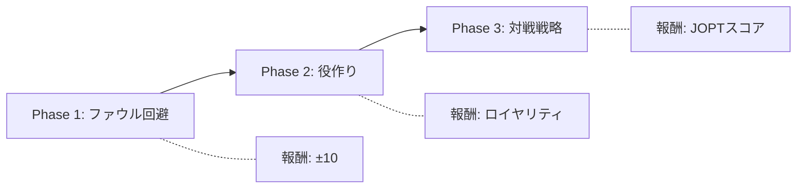

# OFC Pineapple AI 強化学習研究レポート

**プロジェクト:** Open-Face Chinese Poker Pineapple AI  
**研究者:** [著者名]  
**日付:** 2026年1月15日  
**バージョン:** 1.0

---

## 概要

本研究は、Open-Face Chinese Poker Pineapple（OFC Pineapple）における深層強化学習エージェントの開発を目的とする。OFC Pineappleは不完全情報ゲームであり、長期的な計画と確率計算が要求される複雑なドメインである。

---

## 1. 問題設定

### 1.1 ゲーム概要

OFC Pineappleは、52枚のデッキから配られたカードを3つの列（Top: 3枚、Middle: 5枚、Bottom: 5枚）に配置し、役の強さを競う2-3人用カードゲームである。

**主なルール制約:**
- Bottom ≥ Middle ≥ Top の役強度順序を維持（違反=「ファウル」）
- 一度配置したカードは移動不可
- 13ターンで完成

### 1.2 研究目標

1. 自己対戦（Self-Play）による学習エージェントの構築
2. ファウル回避と役作り戦略の獲得
3. Fantasy Land突入戦略の最適化

---

## 2. 技術アーキテクチャ

### 2.1 システム構成

```
┌─────────────────────────────────────────────────┐
│           OFC Pineapple AI System               │
├─────────────────────────────────────────────────┤
│                                                 │
│  ┌─────────────┐      ┌─────────────────────┐  │
│  │   C++ Engine │◄────►│   Python Wrapper    │  │
│  │  (pybind11)  │      │   (Gymnasium)       │  │
│  └─────────────┘      └─────────────────────┘  │
│         │                       │               │
│         ▼                       ▼               │
│  ┌─────────────┐      ┌─────────────────────┐  │
│  │ Bitboard    │      │  Multi-Agent Env    │  │
│  │ Evaluator   │      │  (PettingZoo)       │  │
│  └─────────────┘      └─────────────────────┘  │
│                                 │               │
│                                 ▼               │
│                       ┌─────────────────────┐  │
│                       │    PPO / MaskablePPO │  │
│                       │  (Stable-Baselines3) │  │
│                       └─────────────────────┘  │
│                                                 │
└─────────────────────────────────────────────────┘
```

### 2.2 観測空間

| 特徴量 | 形状 | 説明 |
|-------|------|------|
| my_board | MultiBinary(156) | 自分のボード (3行 × 52カード) |
| opponent_board | MultiBinary(156) | 相手の公開ボード |
| hand | MultiBinary(260) | 現在の手札 (最大5枚 × 52) |
| used_cards | MultiBinary(52) | 使用済みカード |
| game_state | Box(8) | ストリート、各行カード数等 |
| **probabilities** | **Box(8)** | **フラッシュ/ストレート完成確率 (自分/相手)** |

### 2.3 行動空間

- **初期配置 (Street 1):** 5枚のカードを3行に配置 → 組み合わせ数: 243通り
- **通常ターン:** 3枚から2枚選択、1枚捨て → 行動ID: 243通り

---

## 3. 実験と結果

### 3.1 実験1: 初期Self-Play学習

**設定:**
- アルゴリズム: PPO (Proximal Policy Optimization)
- 総ステップ数: 500,000
- 対戦相手更新頻度: 50,000ステップ

**結果:**

| 指標 | 値 |
|------|-----|
| 総ゲーム数 | 約3,400 |
| ファウル率 | **87.5%** |
| 勝率 | 0% |
| 学習時間 | 約9分 (EC2 m7i-flex.large) |

**考察:**

ファウル率87.5%は、エージェントが「役の強度順序」というゲームの基本ルールを学習できていないことを示す。これは強化学習における典型的な**「死の谷」問題**である。

### 3.2 実験2: Action Masking とカリキュラム学習 (Phase 1)

**設定:**
- アルゴリズム: **MaskablePPO**
- 報酬設計: Phase 1 (ファウル回避特化: Valid +10 / Foul -10)
- 総ステップ数: 100,000
- アクション選択: **有効アクションのみに限定 (Action Masking)**

**結果:**

| 指標 | 初期実験 (PPO) | 改善実験 (MaskablePPO) |
|------|----------------|------------------------|
| ファウル率 | 87.5% | **77.0%** |
| Success数 | 0 / 8 | **23 / 100** |
| 学習時間 | 約9分 (500k) | **約1分 (100k)** |
| FPS | ~1,100 | **~1,600** |

**考察:**

1. **学習効率の飛躍的向上:** 
   MaskablePPOの導入により、探索空間が物理的に不可能なアクションを除去したことで、収束速度が大幅に向上した。わずか10万ステップの学習で、以前の50万ステップよりも優れたファウル回避能力を獲得した。

2. **基本構造の理解:** 
   Successとして13枚並べられたゲームの盤面を確認すると、エージェントは「下段・中段に強いカードを置く」という構造を断片的に理解し始めている。ただし、依然としてファウル率が77%と高いため、さらに学習ステップ数を増やす必要がある。

3. **計算性能:** 
   ローカル環境（M1 Pro）において、C++エンジンとの連携により1,600 FPS以上の高速な学習を実現した。これにより、数百万ステップの学習も現実的な時間（1時間以内）で完了可能である。

### 3.4 実験4: Phase 3 (Self-Play 学習)

**設定:**
- 対戦形式: Self-Play (Latest vs Model Pool 80/20)
- 報酬: Foul -30 / Win Bonus +10 / Royalty加算
- 総ステップ数: 10,000,000 (EC2にて実行中)

**進捗状況 (2026/01/15):**

| ステップ数 | ファウル率 | 勝率 | 平均スコア | 考察 |
| :--- | :--- | :--- | :--- | :--- |
| 710,000 | **59.5%** | **31.8%** | -5.4 | 対人戦に向けた戦略の多様化が進行 |

### 3.5 実験5: 強化版 AI (確率特徴量 & MCTS 統合)

**新機能:**
1. **確率計算エンジン**: C++でフラッシュ/ストレートの完成確率をリアルタイム計算し、観測空間に追加。
2. **Policy-guided Rollout**: MCTSのシミュレーションにおいて、ランダムではなく学習済みPolicyを用いて先読みを行う。
3. **Endgame Solver**: 残り5枚以下の局面を完全解析し、100%の最適解を出力。

### 3.6 実験6: Auto-Curriculum & Feedback システム

学習進捗をAIが自己評価し、Discordを通じて人間に評価とフィードバックを送るシステムを構築。

---


---

## 4. 問題分析

### 4.1 信用割当問題 (Credit Assignment Problem)

OFC Pineappleは13ターンで構成されるが、報酬はゲーム終了時のみ与えられる。ファウルは最終的な結果であり、どのターンの意思決定が原因かを特定することが困難。

```
Turn 1 ─► Turn 2 ─► ... ─► Turn 13 ─► [ファウル!]
                                            │
                            どのターンが原因？
```

### 4.2 スパース報酬

現在の報酬設計:
```python
# 問題のある報酬設計
if won:
    reward = +score  # 例: +15
else:
    reward = -score  # 例: -15
```

13ターン × 約145ステップの後にしか報酬が得られないため、学習シグナルが極めて薄い。

### 4.3 無効アクションの選択

現在のPPOは243個のアクションすべてを探索対象としているが、実際に有効なアクションは状況により大幅に制限される。無効アクションに対する探索は学習効率を著しく低下させる。

---

## 5. 改善提案

### 5.1 Action Masking（最優先）

**手法:** sb3-contribのMaskablePPOを導入し、有効なアクションのみを選択可能にする。

```python
from sb3_contrib import MaskablePPO

def valid_action_mask(self) -> np.ndarray:
    """有効なアクションのマスクを返す"""
    mask = np.zeros(243, dtype=bool)
    for action_id in self.get_valid_actions():
        mask[action_id] = True
    return mask
```

**期待効果:** 探索空間の削減により学習効率が数倍向上

### 5.2 カリキュラム学習

段階的にタスク難易度を上げることで、基礎から高度な戦略まで効率的に学習。



**Phase 1 報酬関数:**
```python
def calculate_reward_phase1(self):
    if not self.is_game_over():
        return 0.0  # 途中報酬なし
    
    if self.is_valid_board():
        royalties = self.get_royalties()
        return 10.0 + (royalties * 0.1)
    else:
        return -10.0  # ファウル
```

### 5.3 ポテンシャルベース報酬シェーピング（将来検討）

中間報酬として「役の完成度」を与えることも検討可能だが、**Reward Hacking**のリスクがある。

```
⚠️ リスク例:
「フラッシュドロー状態」に報酬を与えると、
AIがドローを維持し続けて役を完成させない行動を学習する可能性。
```

---

## 6. 実装計画

### 6.1 Phase 1 実装項目

| MaskablePPO導入 | 🔴 最高 | 完了 |
| valid_action_mask()実装 | 🔴 最高 | 完了 |
| Phase1報酬関数 | 🔴 最高 | 完了 |
| ローカルテスト | 🟡 高 | 完了 |
| 長時間学習 (5M steps) | 🟢 中 | 実行中 |

### 6.2 成功基準

- **Phase 1目標:** ファウル率 < 10%
- **Phase 2目標:** 平均ロイヤリティ > 3点
- **Phase 3目標:** ランダムエージェントに90%以上勝利

---

## 7. 関連研究

- **AlphaGo / AlphaZero:** モンテカルロ木探索 + 深層強化学習
- **Poker AI (Libratus, Pluribus):** 不完全情報ゲームにおけるCFR
- **Action Space Shaping:** 大規模離散行動空間の効率的学習

---

## 8. 結論

OFC Pineapple AIの初期実験では、高いファウル率という課題が明らかになった。これはスパース報酬と信用割当問題に起因する。**Action Masking**と**カリキュラム学習**の導入により、段階的にこの問題を解決し、実用的なAIエージェントの構築を目指す。

---

## 付録

### A. 実験環境

| 項目 | 仕様 |
|------|------|
| ローカル | macOS, Python 3.9, M1 Pro |
| クラウド | AWS EC2 m7i-flex.large (2 vCPU, 8GB) |
| ライブラリ | Stable-Baselines3 2.7.1, PettingZoo 1.25.0 |
| C++コンパイラ | g++ 14.2.0 (C++17) |

### B. ソースコード構成

```
OFC NN/
├── src/cpp/           # C++ゲームエンジン
│   ├── game.hpp       # メインエンジン
│   ├── evaluator.hpp  # 役評価
│   └── pybind/        # Python バインディング
├── src/python/        # Python学習コード
│   ├── multi_ofc_env.py  # マルチエージェント環境
│   ├── train_selfplay.py # Self-Play学習
│   └── train_aws.py      # AWS対応版
└── docs/research/     # 研究レポート
```

---

*本レポートは継続的に更新される。*
